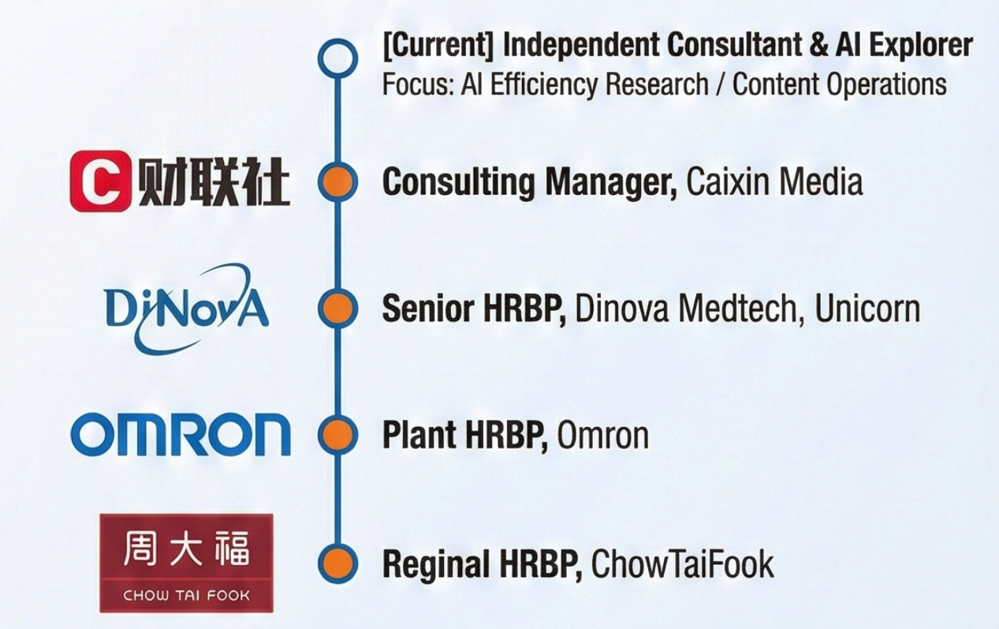

  

 

<h1 align="center">Hi, I'm Joanna Shen 👋</h1>
<h3 align="center">
  AI Efficiency Architect | HR Strategist | MedTech Specialist
</h3>

  <em>"Deep Business Insight combined with AI Stacks to Redefine Enterprise Efficiency."</em>

  

 

## 🌟 Why I Am Unique? (My Dual-Core Engine)

  

 

## 🚀 Professional Journey

  

 

## 📂 Featured Projects (实战案例)

| Project | Tech Stack | Business Impact |
| :--- | :--- | :--- |
| **🤖 MedTech Intelligence Engine** | `RPA` `Claude Code` `Python` | **4h → 10mins** daily research time reduction. Real-time competitive analysis. |
| **🎬 AI Content Matrix** | `HeyGen` `Suno` `CapCut` | Built a full "Text-to-Video" workflow. Produced **100+** videos with zero outsourcing. |
| **🎥 Video Assembly Engine** | `Python` `Streamlit` `FFmpeg` | An experimental automation tool for batch video processing. *(Repository Archived)* |

 

## 🛠️ Tech & Tools

  
  
  
  
  

 

## 📫 Let's Connect

  <table border="0">
    <tr>
      <td width="30%" align="center" valign="center">
         
        <b>Scan to Chat</b>
      </td>
      <td valign="center">
        <ul>
          <li><b>WeChat ID:</b> a9joanna01</li>
          <li><b>Email:</b> <a href="mailto:joanna_sym@qq.com">joanna_sym@qq.com</a></li>
          <li><b>Focus:</b> HR Digital Transformation, AI Workflow Optimization</li>
        </ul>
      </td>
    </tr>
  </table>

